# Brainstorming Ideas Into Designs - OpenAgent Version

## Overview

Help turn ideas into fully formed designs and specs through natural collaborative dialogue **with approval gates at each phase.**

Start by understanding the current project context, then ask questions one at a time to refine the idea. Once you understand what you're building, present the design in small sections (200-300 words), checking after each section whether it looks right so far.

**OpenAgent integration:** This skill integrates approval gates from OpenAgent's safety-first philosophy. You will request approval before each major phase to ensure user awareness and consent.

## When to Use

**Always before:**
- Creating new features
- Building new components
- Adding functionality
- Modifying existing behavior
- Any creative or architectural work

**Exceptions (ask your human partner):**
- Trivial changes
- Bug fixes with clear solution
- Documentation updates

Thinking "skip brainstorming, I know what to build"? Stop. That's rationalization.

## The Process with Approval Gates

```dot
digraph brainstorming_openagent {
    rankdir=TB;
    approval_context [label="⏸️ REQUEST\nAPPROVAL\nto explore context", shape=diamond, style=filled, fillcolor="#ffffcc"];
    context [label="Explore project\ncontext", shape=box, style=filled, fillcolor="#ccccff"];
    approval_questions [label="⏸️ REQUEST\nAPPROVAL\nto ask questions", shape=diamond, style=filled, fillcolor="#ffffcc"];
    questions [label="Ask questions\none at a time", shape=box, style=filled, fillcolor="#ccccff"];
    more_questions [label="Need more\nclarity?", shape=diamond];
    approval_approaches [label="⏸️ REQUEST\nAPPROVAL\nto propose approaches", shape=diamond, style=filled, fillcolor="#ffffcc"];
    approaches [label="Present 2-3\napproaches", shape=box, style=filled, fillcolor="#ccffcc"];
    approval_design [label="⏸️ REQUEST\nAPPROVAL\nto present design", shape=diamond, style=filled, fillcolor="#ffffcc"];
    design [label="Present design\nsection", shape=box, style=filled, fillcolor="#ccffcc"];
    more_sections [label="More\nsections?", shape=diamond];
    approval_write [label="⏸️ REQUEST\nAPPROVAL\nto write doc", shape=diamond, style=filled, fillcolor="#ffffcc"];
    write [label="Write design\ndocument", shape=box, style=filled, fillcolor="#ccccff"];
    approval_commit [label="⏸️ REQUEST\nAPPROVAL\nto commit", shape=diamond, style=filled, fillcolor="#ffffcc"];
    commit [label="Commit design\ndoc", shape=box, style=filled, fillcolor="#ccccff"];
    approval_setup [label="⏸️ REQUEST\nAPPROVAL\nfor implementation setup", shape=diamond, style=filled, fillcolor="#ffffcc"];
    setup [label="Set up worktree\nand plan", shape=box, style=filled, fillcolor="#ccffcc"];
    done [label="Done", shape=ellipse];

    approval_context -> context [label="approved"];
    context -> approval_questions;
    approval_questions -> questions [label="approved"];
    questions -> more_questions;
    more_questions -> questions [label="yes"];
    more_questions -> approval_approaches [label="no"];
    approval_approaches -> approaches [label="approved"];
    approaches -> approval_design;
    approval_design -> design [label="approved"];
    design -> more_sections;
    more_sections -> design [label="yes"];
    more_sections -> approval_write [label="no"];
    approval_write -> write [label="approved"];
    write -> approval_commit;
    approval_commit -> commit [label="approved"];
    commit -> approval_setup;
    approval_setup -> setup [label="approved"];
    approval_setup -> done [label="skip"];
    setup -> done;
}
```



### Phase 1: Understanding Project Context

**⏸️ REQUEST APPROVAL:** "May I explore the current project context to understand what we're building on?"

**After approval, check out:**
- Relevant files and documentation
- Recent commits to understand current state
- Existing patterns and conventions

**Keep it focused** - only read what's needed to understand the starting point.

**⏸️ REPORT TO USER:** "I've reviewed [list key files/docs]. Here's what I understand: [brief summary]. Ready to ask questions to refine the idea?"

### Phase 2: Understanding the Idea

**⏸️ REQUEST APPROVAL:** "May I ask questions to refine and understand this idea better?"

**After approval, ask questions one at a time:**
- Focus on: purpose, constraints, success criteria
- Prefer multiple choice when possible
- Open-ended is fine when exploration needed
- **Only one question per message**
- If a topic needs more exploration, break into multiple questions

**Example questions:**
- "What's the primary goal: [A], [B], or [C]?"
- "Should this handle [edge case]?"
- "How should this behave when [scenario]?"

**⏸️ AFTER EACH ANSWER:** Continue with next question or report understanding

**⏸️ REPORT TO USER:** "I now understand: [summarize understanding]. Ready to explore different approaches?"

### Phase 3: Exploring Approaches

**⏸️ REQUEST APPROVAL:** "May I propose 2-3 different approaches with trade-offs?"

**After approval, present options conversationally:**
- Lead with your recommended option
- Explain why you recommend it
- Present 1-2 alternatives with trade-offs
- Be objective about pros/cons

**Example:**
```
I recommend [Approach A] because [reasoning].

Alternatively:
- [Approach B]: [trade-offs]
- [Approach C]: [trade-offs]

Which direction feels right to you?
```

**⏸️ REPORT TO USER:** "User selected [approach]. Ready to present the detailed design?"

### Phase 4: Presenting the Design

**⏸️ REQUEST APPROVAL:** "May I present the design in sections for validation?"

**After approval, present design incrementally:**

**Break into sections of 200-300 words each:**
1. Architecture overview
2. Components and their responsibilities
3. Data flow
4. Error handling
5. Testing strategy

**After each section:** "Does this section look right so far?"

**Be ready to:**
- Go back and clarify
- Revise based on feedback
- Add missing details

**Key principles during presentation:**
- **YAGNI ruthlessly** - Remove unnecessary features
- **Be concrete** - Specific APIs, data structures
- **Show examples** - Code snippets where helpful
- **Stay flexible** - Adapt based on feedback

**⏸️ REPORT TO USER:** "Design validated through all sections. Ready to write the design document?"

### Phase 5: Documentation

**⏸️ REQUEST APPROVAL:** "May I write the validated design to docs/plans/YYYY-MM-DD-<topic>-design.md?"

**After approval, create design document:**

**Structure:**
```markdown
# [Feature Name] Design

## Overview
[Brief summary]

## Goals
[What we're trying to achieve]

## Approach
[Selected approach and why]

## Architecture
[System design]

## Components
[Component breakdown]

## Data Flow
[How data moves through system]

## Error Handling
[How errors are handled]

## Testing Strategy
[How we'll verify it works]

## Implementation Notes
[Key considerations]
```

**Use clear, concise writing:**
- Active voice
- Short sentences
- Concrete examples
- Use elements-of-style:writing-clearly-and-concisely skill if available

**⏸️ REPORT TO USER:** "Design document written to [path]. Ready to commit?"

### Phase 6: Commit Design Document

**⏸️ REQUEST APPROVAL:** "May I commit the design document? File: [path]"

**After approval:**

```bash
git add docs/plans/YYYY-MM-DD-<topic>-design.md
git commit -m "docs: add [feature] design"
```

**⏸️ REPORT TO USER:** "Design committed. Ready to set up for implementation?"

### Phase 7: Implementation Setup (Optional)

**⏸️ REQUEST APPROVAL:** "Ready to set up for implementation? This will create a worktree and implementation plan."

**After approval:**

1. Use custom/openagent-git-worktrees to create isolated workspace
2. Use superpowers:writing-plans to create detailed implementation plan

**If user declines:** Design phase complete. User can implement later.

## Key Principles

- **One question at a time** - Don't overwhelm with multiple questions
- **Multiple choice preferred** - Easier to answer than open-ended when possible
- **YAGNI ruthlessly** - Remove unnecessary features from all designs
- **Explore alternatives** - Always propose 2-3 approaches before settling
- **Incremental validation** - Present design in sections, validate each
- **Be flexible** - Go back and clarify when something doesn't make sense
- **Request approval at checkpoints** - Ensures user awareness and consent

## Common Rationalizations

| Excuse | Reality |
|--------|---------|
| "The idea is clear, skip questions" | User has vision, you need details. Ask questions. |
| "One approach is obviously best" | Present alternatives anyway. User might see different trade-offs. |
| "Design is simple, present all at once" | Incremental validation catches issues early. Present in sections. |
| "Skip documentation, start coding" | Design doc is reference for implementation. Write it. |
| "Approval gates slow things down" | Gates catch misunderstandings before coding. Faster overall. |
| "User said 'just build it'" | User wants result, not rushed work. Follow process. |

## Red Flags - STOP and Follow Process

- Reading files without approval
- Asking multiple questions at once
- Presenting design without exploring approaches
- Skipping sections during design presentation
- Starting implementation without design doc
- Committing without approval
- **Skipping approval gates to "save time"**

**All of these mean: Stop. Request approval. Follow process.**

## Example: New Feature with Approval Gates

**User:** "I want to add user authentication"

**⏸️ REQUEST APPROVAL:** "May I explore the current project to understand the starting point?"

**After approval - explore context:**
- Read package.json (see we use Express)
- Check existing routes
- Look for any auth-related code

**⏸️ REPORT:** "I see you're using Express with no current auth. Ready to ask questions to refine requirements?"

**After approval - ask questions one at a time:**

**Q1:** "What authentication method: (A) JWT tokens, (B) sessions, or (C) OAuth?"

**Answer:** "JWT tokens"

**Q2:** "Should we support refresh tokens for long-lived sessions?"

**Answer:** "Yes"

**Q3:** "How should we handle password storage: (A) bcrypt, (B) argon2, or (C) other?"

**Answer:** "bcrypt"

**⏸️ REPORT:** "I understand: JWT auth with refresh tokens and bcrypt password hashing. Ready to explore approaches?"

**After approval - present approaches:**

**"I recommend JWT in httpOnly cookies because [security, XSS protection].**

**Alternatively:**
- Bearer tokens in Authorization header: [simpler, but requires client storage]
- Session-based with Redis: [more traditional, needs Redis infrastructure]

**Which feels right?"**

**Answer:** "httpOnly cookies"

**⏸️ REPORT:** "User selected httpOnly cookie approach. Ready to present detailed design?"

**After approval - present design in sections:**

**Section 1 - Architecture (200 words):**
[Present architecture overview]
"Does this look right so far?"

**Section 2 - Components (250 words):**
[Present AuthService, TokenService, middleware]
"Does this look right so far?"

**Section 3 - Data Flow (200 words):**
[Present login/logout/refresh flow]
"Does this look right so far?"

**Section 4 - Error Handling (200 words):**
[Present error cases]
"Does this look right so far?"

**Section 5 - Testing Strategy (200 words):**
[Present test approach]
"Does this look right so far?"

**⏸️ REPORT:** "All design sections validated. Ready to write design document?"

**After approval - write doc:**
Create docs/plans/2026-02-06-user-authentication-design.md

**⏸️ REPORT:** "Design doc written. Ready to commit?"

**After approval - commit:**
```bash
git add docs/plans/2026-02-06-user-authentication-design.md
git commit -m "docs: add user authentication design"
```

**⏸️ REPORT:** "Design committed. Ready to set up for implementation?"

**If approved - setup:**
Load custom/openagent-git-worktrees, create worktree, write plan

## OpenAgent Approval Gate Summary

**Approval points in brainstorming cycle:**
1. ⏸️ Before exploring project context
2. ⏸️ Before asking questions to refine idea
3. ⏸️ Before proposing approaches
4. ⏸️ Before presenting design sections
5. ⏸️ Before writing design document
6. ⏸️ Before committing design doc
7. ⏸️ Before setting up implementation (optional)

**Why approval gates matter:**
- Ensures user awareness at each phase
- Prevents premature design decisions
- Aligns with OpenAgent's safety-first philosophy
- Creates natural checkpoints for course correction
- Respects user's time and input

## Verification Checklist

Before marking brainstorming complete:

- [ ] Explored project context with approval
- [ ] Asked questions one at a time
- [ ] Proposed 2-3 approaches with trade-offs
- [ ] Presented design in sections (200-300 words each)
- [ ] Validated each section with user
- [ ] Applied YAGNI ruthlessly
- [ ] Written design document
- [ ] Committed design document
- [ ] **Requested approval at each phase checkpoint**

Can't check all boxes? You skipped the process. Start over.

## Final Rule

```
Creative work → brainstorm with questions → validate design sections → approval at each phase
Otherwise → not OpenAgent brainstorming
```

No exceptions without your human partner's permission.
