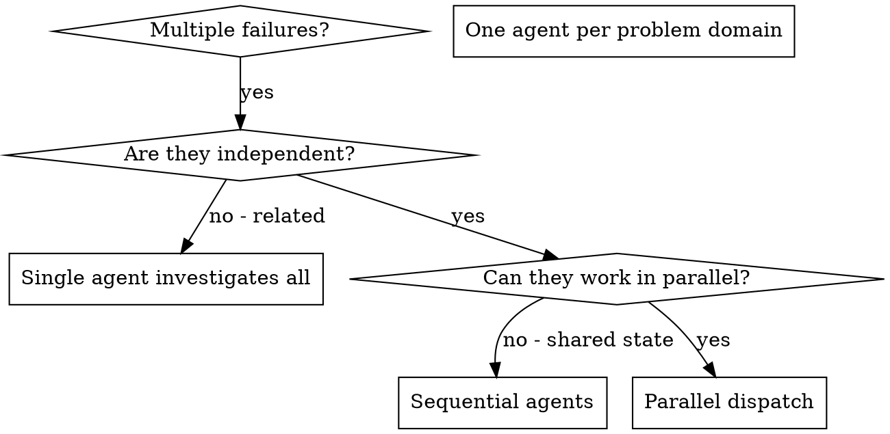

# Dispatching Parallel Agents - OpenAgent Version

## Overview

When you have multiple unrelated failures (different test files, different subsystems, different bugs), investigating them sequentially wastes time. Each investigation is independent and can happen in parallel. **With approval gates at each phase.**

**Core principle:** Dispatch one agent per independent problem domain. Let them work concurrently.

**OpenAgent integration:** This skill integrates approval gates from OpenAgent's safety-first philosophy. You will request approval before identifying domains, dispatching agents, and integrating changes.

## When to Use



**Use when:**
- 3+ test files failing with different root causes
- Multiple subsystems broken independently
- Each problem can be understood without context from others
- No shared state between investigations

**Don't use when:**
- Failures are related (fix one might fix others)
- Need to understand full system state
- Agents would interfere with each other

## The Pattern with Approval Gates

### 1. Identify Independent Domains

**⏸️ REQUEST APPROVAL:** "May I analyze these failures to identify independent problem domains?"

**After approval, group failures by what's broken:**
- File A tests: Tool approval flow
- File B tests: Batch completion behavior
- File C tests: Abort functionality

Each domain is independent - fixing tool approval doesn't affect abort tests.

**⏸️ REPORT TO USER:** "Identified [N] independent domains: [list domains]. These can be worked in parallel. Ready to proceed?"

### 2. Create Focused Agent Tasks

**⏸️ REQUEST APPROVAL:** "May I create agent tasks for these [N] domains? Review scope below:"

**After approval, each agent gets:**
- **Specific scope:** One test file or subsystem
- **Clear goal:** Make these tests pass
- **Constraints:** Don't change other code
- **Expected output:** Summary of what you found and fixed

### 3. Dispatch in Parallel

**⏸️ REQUEST APPROVAL:** "May I dispatch [N] agents in parallel with the following tasks?"

**After approval, dispatch concurrently:**

```typescript
// In Claude Code / AI environment
Task("Fix agent-tool-abort.test.ts failures")
Task("Fix batch-completion-behavior.test.ts failures")
Task("Fix tool-approval-race-conditions.test.ts failures")
// All three run concurrently
```

### 4. Review and Integrate

**⏸️ REPORT AGENT SUMMARIES:** "All agents have returned. Summaries:
- Agent 1: [summary]
- Agent 2: [summary]
- Agent 3: [summary]"

**After reporting, verify:**
- Read each summary
- Verify fixes don't conflict
- **⏸️ REQUEST APPROVAL:** "May I integrate all changes and run the full test suite?"

**After approval:**
- Run full test suite
- Integrate all changes

**⏸️ REPORT RESULTS:** "Integration complete. Test results: [show output]"

## Agent Prompt Structure

Good agent prompts are:
1. **Focused** - One clear problem domain
2. **Self-contained** - All context needed to understand the problem
3. **Specific about output** - What should the agent return?

```markdown
Fix the 3 failing tests in src/agents/agent-tool-abort.test.ts:

1. "should abort tool with partial output capture" - expects 'interrupted at' in message
2. "should handle mixed completed and aborted tools" - fast tool aborted instead of completed
3. "should properly track pendingToolCount" - expects 3 results but gets 0

These are timing/race condition issues. Your task:

1. Read the test file and understand what each test verifies
2. Identify root cause - timing issues or actual bugs?
3. Fix by:
   - Replacing arbitrary timeouts with event-based waiting
   - Fixing bugs in abort implementation if found
   - Adjusting test expectations if testing changed behavior

Do NOT just increase timeouts - find the real issue.

Return: Summary of what you found and what you fixed.
```

## Common Mistakes

**❌ Too broad:** "Fix all the tests" - agent gets lost
**✅ Specific:** "Fix agent-tool-abort.test.ts" - focused scope

**❌ No context:** "Fix the race condition" - agent doesn't know where
**✅ Context:** Paste the error messages and test names

**❌ No constraints:** Agent might refactor everything
**✅ Constraints:** "Do NOT change production code" or "Fix tests only"

**❌ Vague output:** "Fix it" - you don't know what changed
**✅ Specific:** "Return summary of root cause and changes"

**❌ Skipping approval gates:** Dispatching agents without user awareness
**✅ Request approval:** Before identifying domains, creating tasks, dispatching agents

## When NOT to Use

**Related failures:** Fixing one might fix others - investigate together first
**Need full context:** Understanding requires seeing entire system
**Exploratory debugging:** You don't know what's broken yet
**Shared state:** Agents would interfere (editing same files, using same resources)

## Real Example with Approval Gates

**Scenario:** 6 test failures across 3 files after major refactoring

**Failures:**
- agent-tool-abort.test.ts: 3 failures (timing issues)
- batch-completion-behavior.test.ts: 2 failures (tools not executing)
- tool-approval-race-conditions.test.ts: 1 failure (execution count = 0)

**⏸️ REQUEST APPROVAL:** "May I analyze these 6 failures to identify independent domains?"

**After approval - Analysis:**
Independent domains - abort logic separate from batch completion separate from race conditions

**⏸️ REPORT:** "Identified 3 independent domains. Ready to create agent tasks?"

**After approval - Dispatch:**
```
Agent 1 → Fix agent-tool-abort.test.ts
Agent 2 → Fix batch-completion-behavior.test.ts
Agent 3 → Fix tool-approval-race-conditions.test.ts
```

**⏸️ REQUEST APPROVAL:** "May I dispatch these 3 agents in parallel?"

**After approval - Work:**
- Agent 1: Replaced timeouts with event-based waiting
- Agent 2: Fixed event structure bug (threadId in wrong place)
- Agent 3: Added wait for async tool execution to complete

**⏸️ REPORT SUMMARIES:** "All agents returned:
- Agent 1: Replaced setTimeout with event-based waiting
- Agent 2: Fixed threadId placement in event structure
- Agent 3: Added async wait for tool execution

Ready to integrate and test?"

**After approval - Integration:**
All fixes independent, no conflicts, full suite green

**⏸️ REPORT RESULTS:** "Integration complete. All tests pass. 6 failures resolved."

**Time saved:** 3 problems solved in parallel vs sequentially

## Key Benefits

1. **Parallelization** - Multiple investigations happen simultaneously
2. **Focus** - Each agent has narrow scope, less context to track
3. **Independence** - Agents don't interfere with each other
4. **Speed** - 3 problems solved in time of 1
5. **Safety** - Approval gates ensure user awareness at each phase

## Verification

After agents return:
1. **Review each summary** - Understand what changed
2. **Check for conflicts** - Did agents edit same code?
3. **⏸️ REQUEST APPROVAL** - Before running full test suite
4. **Run full suite** - Verify all fixes work together
5. **Spot check** - Agents can make systematic errors
6. **⏸️ REPORT RESULTS** - Show final verification output

## OpenAgent Approval Gate Summary

**Approval points in parallel agent dispatch:**
1. ⏸️ Before identifying independent domains
2. ⏸️ Before creating agent tasks (review scope)
3. ⏸️ Before dispatching agents in parallel
4. ⏸️ After agents return (report summaries)
5. ⏸️ Before integrating changes
6. ⏸️ Before running full test suite
7. ⏸️ After verification (report results)

**Why approval gates matter:**
- Prevents hasty task decomposition
- Ensures user awareness of parallel work
- Aligns with OpenAgent's safety-first philosophy
- Creates natural checkpoints for review
- Prevents integration conflicts

## Red Flags - STOP and Ask

- Dispatching agents without domain analysis
- No clear boundaries between agent tasks
- Agents working on related/dependent problems
- Skipping approval gates to "move faster"
- Integrating changes without user review
- "I'll just dispatch these quickly"
- "User doesn't need to know about internal parallelization"

**All of these mean: Request approval before proceeding.**

## Real-World Impact

From debugging session (2025-10-03):
- 6 failures across 3 files
- 3 agents dispatched in parallel
- All investigations completed concurrently
- All fixes integrated successfully
- Zero conflicts between agent changes
- User maintained awareness at each phase

## Final Rule

```
Parallel agent work → approval before dispatch → approval before integration
Otherwise → not OpenAgent parallel dispatch
```

No exceptions without your human partner's permission.
