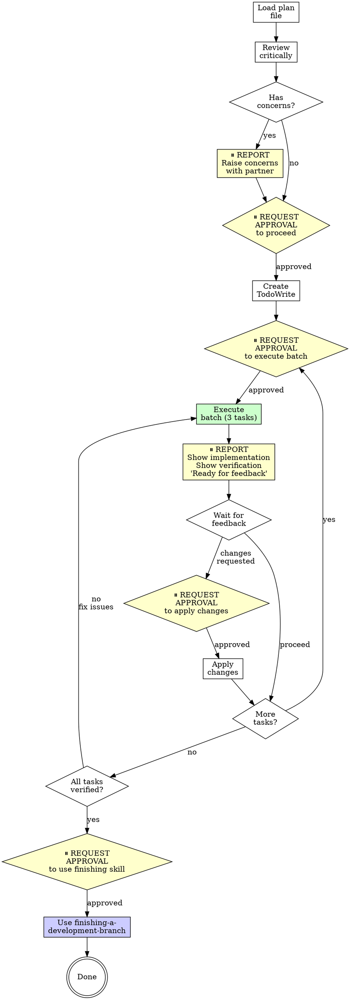

# Executing Plans - OpenAgent Version

## Overview

Load plan, review critically, execute tasks in batches, report for review between batches. **With approval gates at each checkpoint.**

**Core principle:** Batch execution with checkpoints for architect review and user approval.

**OpenAgent integration:** This skill integrates approval gates from OpenAgent's safety-first philosophy. You will request approval before executing each batch and wait for feedback between batches.

**Announce at start:** "I'm using the openagent-executing-plans skill to implement this plan."

## When to Use

**Always:**
- Executing written implementation plans
- Multi-task development work
- Batch execution workflows

**When NOT to use:**
- Single-step tasks (use appropriate implementation skill directly)
- Exploratory work without a plan (use brainstorming first)

## The Process with Approval Gates



### Step 1: Load and Review Plan

**⏸️ AUTOMATIC REVIEW (no approval needed yet):**

1. Read plan file
2. Review critically - identify any questions or concerns about the plan:
   - Are requirements clear?
   - Are dependencies available?
   - Are steps actionable?
   - Are verification steps specified?
   - Are there gaps or ambiguities?

**⏸️ REPORT CONCERNS (if any):** 
"I've reviewed the plan and have the following concerns: [list concerns]. Should we address these before proceeding?"

**⏸️ REQUEST APPROVAL TO PROCEED:**
"The plan looks good. May I proceed with creating todos and executing the first batch (tasks 1-3)?"

**After approval:**
- Create TodoWrite for all tasks in plan
- Mark first batch (3 tasks) for execution

### Step 2: Execute Batch

**⏸️ REQUEST APPROVAL:** "May I execute batch [N] (tasks [X-Y])?"

**After approval, execute default first 3 tasks:**

For each task:
1. Mark as in_progress
2. Follow each step exactly (plan has bite-sized steps)
3. Run verifications as specified
4. Mark as completed

**Requirements:**
- Follow plan steps exactly
- Don't skip verifications
- Reference skills when plan says to
- Stop if blocked (see "When to Stop" below)

### Step 3: Report

**⏸️ REPORT TO USER (mandatory after each batch):**

When batch complete:
```
Batch [N] complete (tasks [X-Y]):

Implementation:
- [What was implemented]
- [Key changes made]

Verification:
[Show verification output - test results, linting, etc.]

Ready for feedback.
```

**DO NOT proceed to next batch without user response.**

### Step 4: Continue Based on Feedback

**Wait for user feedback, then:**

**If changes requested:**
- **⏸️ REQUEST APPROVAL:** "May I apply the following changes: [summarize changes]?"
- After approval, apply changes
- Re-verify
- Report results

**If approved to proceed:**
- Return to Step 2 for next batch

### Step 5: Complete Development

**After all tasks complete and verified:**

**⏸️ REQUEST APPROVAL:** "All tasks complete. May I use the finishing-a-development-branch skill to complete this work?"

**After approval:**
- Announce: "I'm using the finishing-a-development-branch skill to complete this work."
- **REQUIRED SUB-SKILL:** Use custom/openagent-finishing-a-development-branch
- Follow that skill to verify tests, present options, execute choice

## When to Stop and Ask for Help

**STOP executing immediately when:**
- Hit a blocker mid-batch:
  - Missing dependency
  - Test fails
  - Instruction unclear
  - Can't complete step
- Plan has critical gaps preventing starting
- You don't understand an instruction
- Verification fails repeatedly
- Implementation reveals design flaw in plan

**⏸️ REPORT BLOCKER:**
```
Stopped execution on task [X] due to: [specific blocker]

Context:
[What you were trying to do]
[What went wrong]
[What you've tried]

Options:
1. [Suggested approach A]
2. [Suggested approach B]
3. Update plan to address this

How should I proceed?
```

**Ask for clarification rather than guessing.**

## When to Revisit Earlier Steps

**Return to Review (Step 1) when:**
- Partner updates the plan based on your feedback
- Fundamental approach needs rethinking
- Multiple blockers indicate plan needs revision

**Don't force through blockers** - stop and ask.

## OpenAgent Approval Gate Summary

**Approval points in execution workflow:**
1. ⏸️ After loading plan (report concerns or proceed)
2. ⏸️ Before executing each batch
3. ⏸️ After batch complete (report + wait for feedback)
4. ⏸️ Before applying feedback changes
5. ⏸️ Before using finishing-a-development-branch skill

**Why approval gates matter:**
- Prevents runaway execution without oversight
- Ensures user awareness at checkpoints
- Creates natural review points for course correction
- Aligns with OpenAgent's safety-first philosophy
- User maintains control of development flow

## Common Rationalizations

| Excuse | Reality |
|--------|---------|
| "Batch is simple, skip approval" | Even simple batches need oversight. Request approval. |
| "Just one more batch, report after" | Batching reports loses checkpoint value. Report after each. |
| "User said proceed, means all batches" | Approval is per-batch. Request each time. |
| "Blocker is minor, work around it" | Minor blockers reveal design issues. Stop and report. |
| "Plan unclear but I can guess" | Guessing creates bugs. Stop and ask. |
| "Verification failed but code looks good" | Failed verification = something wrong. Fix before proceeding. |
| "Skip finishing skill, just commit" | Finishing skill ensures clean completion. Use it. |

## Red Flags - STOP

- Executing without approval
- Skipping batch reports
- Proceeding without user feedback
- Guessing at unclear instructions
- Working around blockers silently
- Skipping verifications
- Ignoring failed verifications
- **Skipping approval gates to "move faster"**

**All of these mean: Stop. Report. Wait for guidance.**

## Remember

- Review plan critically first
- Request approval before each batch
- Follow plan steps exactly
- Don't skip verifications
- Reference skills when plan says to
- Between batches: report and wait (don't auto-proceed)
- Stop when blocked, don't guess
- Never start implementation on main/master branch without explicit user consent
- **Request approval at each checkpoint**

## Integration

**Required workflow skills:**
- **custom/openagent-using-git-worktrees** - REQUIRED: Set up isolated workspace before starting
- **custom/openagent-writing-plans** - Creates the plan this skill executes
- **custom/openagent-finishing-a-development-branch** - Complete development after all tasks

**Implementation skills referenced in plans:**
- **custom/openagent-test-driven-development** - TDD implementation with approval gates
- **custom/openagent-systematic-debugging** - Debugging with approval gates
- Other domain-specific skills as specified in plan

## Final Rule

```
Executing plan → approval before each batch → report after each batch → wait for feedback
Otherwise → not OpenAgent executing-plans
```

No exceptions without your human partner's permission.
