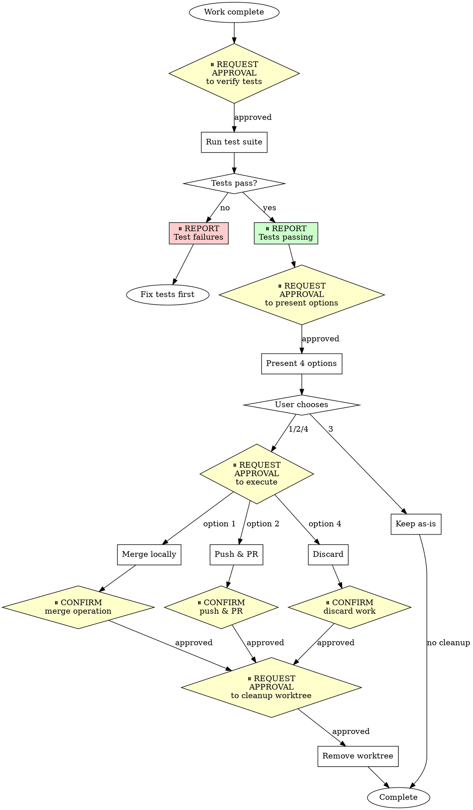

# Finishing a Development Branch - OpenAgent Version

## Overview

Guide completion of development work by presenting clear options and handling chosen workflow. **With approval gates at each decision point.**

**Core principle:** Verify tests → Present options → Execute choice → Clean up.

**OpenAgent integration:** This skill integrates approval gates from OpenAgent's safety-first philosophy. You will request approval before verification, execution, and cleanup steps.

**Announce at start:** "I'm using the openagent-finishing-a-development-branch skill to complete this work."

## The Process with Approval Gates



### Step 1: Verify Tests

**⏸️ REQUEST APPROVAL:** "May I verify that all tests pass before presenting completion options?"

**After approval, run project's test suite:**

```bash
# Run project's test suite
npm test / cargo test / pytest / go test ./...
```

**If tests fail:**

**⏸️ REPORT TO USER:**
```
Tests failing (<N> failures):

[Show failures]

Cannot proceed with merge/PR until tests pass. Would you like me to fix these failures?
```

Stop. Don't proceed to Step 2.

**If tests pass:**

**⏸️ REPORT TO USER:** "All tests passing. Output: [show summary]. Ready to present completion options?"

Continue to Step 2.

### Step 2: Determine Base Branch

```bash
# Try common base branches
git merge-base HEAD main 2>/dev/null || git merge-base HEAD master 2>/dev/null
```

Or ask: "This branch split from main - is that correct?"

### Step 3: Present Options

**⏸️ REQUEST APPROVAL:** "May I present the 4 completion options?"

**After approval, present exactly these 4 options:**

```
Implementation complete. What would you like to do?

1. Merge back to <base-branch> locally
2. Push and create a Pull Request
3. Keep the branch as-is (I'll handle it later)
4. Discard this work

Which option?
```

**Don't add explanation** - keep options concise.

### Step 4: Execute Choice

**After user chooses, request approval for the specific operation.**

#### Option 1: Merge Locally

**⏸️ REQUEST APPROVAL:** "May I merge branch <feature-branch> into <base-branch> locally? This will:
- Switch to <base-branch>
- Pull latest changes
- Merge <feature-branch>
- Verify tests on merged result
- Delete feature branch if successful"

**After approval:**

```bash
# Switch to base branch
git checkout <base-branch>

# Pull latest
git pull

# Merge feature branch
git merge <feature-branch>

# Verify tests on merged result
<test command>

# If tests pass
git branch -d <feature-branch>
```

**⏸️ REPORT:** "Merge complete. Tests still passing on <base-branch>."

Then: Cleanup worktree (Step 5)

#### Option 2: Push and Create PR

**⏸️ REQUEST APPROVAL:** "May I push branch <feature-branch> and create a Pull Request? This will:
- Push <feature-branch> to origin
- Create PR targeting <base-branch>
- Keep worktree for potential updates"

**After approval:**

```bash
# Push branch
git push -u origin <feature-branch>

# Create PR
gh pr create --title "<title>" --body "$(cat <<'EOF'
## Summary
<2-3 bullets of what changed>

## Test Plan
- [ ] <verification steps>
EOF
)"
```

**⏸️ REPORT:** "PR created: [show URL]"

Then: Cleanup worktree (Step 5)

#### Option 3: Keep As-Is

**⏸️ REPORT:** "Keeping branch <name>. Worktree preserved at <path>. No further action needed."

**Don't cleanup worktree.**

#### Option 4: Discard

**⏸️ REQUEST APPROVAL (with explicit confirmation):**
```
This will permanently delete:
- Branch <name>
- All commits:
  <commit-list with hashes and messages>
- Worktree at <path>

This operation CANNOT be undone. Type 'discard' to confirm.
```

Wait for exact confirmation.

**If confirmed:**

```bash
git checkout <base-branch>
git branch -D <feature-branch>
```

**⏸️ REPORT:** "Branch <name> deleted. All commits discarded."

Then: Cleanup worktree (Step 5)

### Step 5: Cleanup Worktree

**For Options 1, 2, 4 only:**

**⏸️ REQUEST APPROVAL:** "May I remove the worktree at <path>? This will delete the working directory but preserve git history."

**After approval, check if in worktree:**

```bash
git worktree list | grep $(git branch --show-current)
```

If yes:
```bash
git worktree remove <worktree-path>
```

**⏸️ REPORT:** "Worktree removed from <path>."

**For Option 3:** Skip this step - keep worktree.

## Quick Reference

| Option | Merge | Push | Keep Worktree | Cleanup Branch | Approval Gates |
|--------|-------|------|---------------|----------------|----------------|
| 1. Merge locally | ✓ | - | - | ✓ | Before merge, before cleanup |
| 2. Create PR | - | ✓ | ✓ (initially) | - | Before push/PR, before cleanup |
| 3. Keep as-is | - | - | ✓ | - | None (report only) |
| 4. Discard | - | - | - | ✓ (force) | Typed confirmation, before cleanup |

## Common Mistakes

**Skipping test verification**
- **Problem:** Merge broken code, create failing PR
- **Fix:** Always verify tests before offering options

**Open-ended questions**
- **Problem:** "What should I do next?" → ambiguous
- **Fix:** Present exactly 4 structured options

**Automatic worktree cleanup**
- **Problem:** Remove worktree when might need it (Option 2, 3)
- **Fix:** Only cleanup for Options 1 and 4 (with approval)

**No confirmation for discard**
- **Problem:** Accidentally delete work
- **Fix:** Require typed "discard" confirmation

**Skipping approval gates to "save time"**
- **Problem:** Destructive operations without user awareness
- **Fix:** Always request approval before merge, push, discard, cleanup

## Red Flags

**Never:**
- Proceed with failing tests
- Merge without verifying tests on result
- Delete work without confirmation
- Force-push without explicit request
- **Skip approval gates for "simple" operations**
- **Execute destructive operations without confirmation**

**Always:**
- Verify tests before offering options
- Present exactly 4 options
- Get typed confirmation for Option 4
- Clean up worktree for Options 1 & 4 only (with approval)
- **Request approval at each decision point**
- **Report outcomes to user**

## OpenAgent Approval Gate Summary

**Approval points in branch completion:**
1. ⏸️ Before verifying tests
2. ⏸️ After test verification (report pass/fail)
3. ⏸️ Before presenting options (if tests pass)
4. ⏸️ After user chooses option (confirm before executing)
5. ⏸️ Before merge operations (Option 1)
6. ⏸️ Before push/PR creation (Option 2)
7. ⏸️ Before discard confirmation (Option 4 - typed "discard")
8. ⏸️ Before worktree cleanup (Options 1, 2, 4)

**Why approval gates matter:**
- Prevents accidental destructive operations
- Ensures user awareness of all git operations
- Aligns with OpenAgent's safety-first philosophy
- Creates natural checkpoints for review
- Allows user to abort before irreversible changes

## Integration

**Called by:**
- **subagent-driven-development** (Step 7) - After all tasks complete
- **executing-plans** (Step 5) - After all batches complete

**Pairs with:**
- **openagent-git-worktrees** - Cleans up worktree created by that skill
- **superpowers/verification-before-completion** - Run before this skill

## Final Rule

```
Every merge, push, discard, or cleanup → approval requested first
Otherwise → not OpenAgent branch completion
```

No exceptions without your human partner's permission.
