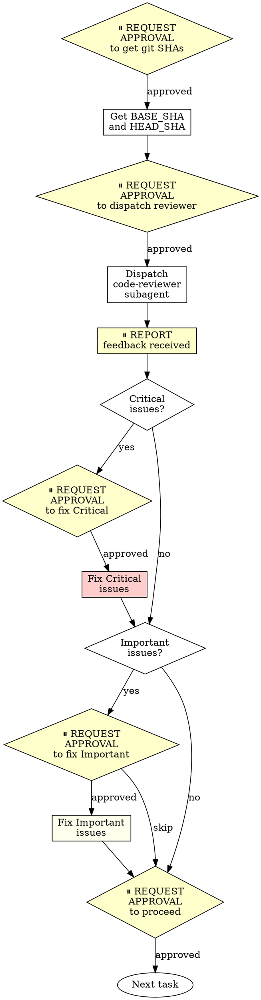

# Requesting Code Review - OpenAgent Version

Dispatch superpowers:code-reviewer subagent to catch issues before they cascade. **With approval gates at each phase.**

**Core principle:** Review early, review often.

**OpenAgent integration:** This skill wraps superpowers:requesting-code-review with approval gates that match OpenAgent's safety-first philosophy. You will request approval before dispatching reviewers and before fixing issues.

## When to Request Review

**Mandatory:**
- After each task in subagent-driven development
- After completing major feature
- Before merge to main

**Optional but valuable:**
- When stuck (fresh perspective)
- Before refactoring (baseline check)
- After fixing complex bug

## How to Request with Approval Gates



### Phase 1: Get Git SHAs

**⏸️ REQUEST APPROVAL:** "May I get git SHAs to identify the code changes for review?"

**After approval:**

```bash
BASE_SHA=$(git rev-parse HEAD~1)  # or origin/main
HEAD_SHA=$(git rev-parse HEAD)
```

### Phase 2: Dispatch Code Reviewer

**⏸️ REQUEST APPROVAL:** "May I dispatch a code-reviewer subagent to review changes from {BASE_SHA} to {HEAD_SHA}?"

**After approval, use Task tool with superpowers:code-reviewer type:**

Fill template at `code-reviewer.md`

**Placeholders:**
- `{WHAT_WAS_IMPLEMENTED}` - What you just built
- `{PLAN_OR_REQUIREMENTS}` - What it should do
- `{BASE_SHA}` - Starting commit
- `{HEAD_SHA}` - Ending commit
- `{DESCRIPTION}` - Brief summary

### Phase 3: Report Feedback

**⏸️ REPORT TO USER:** 

"Code review complete. Summary:

**Strengths:**
- [List strengths from review]

**Issues:**
- Critical: [count and brief list]
- Important: [count and brief list]
- Minor: [count and brief list]

**Assessment:** [reviewer's verdict]

Ready to address issues?"

### Phase 4: Fix Critical Issues

**If Critical issues exist:**

**⏸️ REQUEST APPROVAL:** "May I fix Critical issues? These are: [list with file:line]"

**After approval:**
- Fix each Critical issue
- Run tests to verify fix
- Report completion

### Phase 5: Fix Important Issues

**If Important issues exist:**

**⏸️ REQUEST APPROVAL:** "May I fix Important issues? These are: [list with file:line]"

**After approval:**
- Fix each Important issue
- Run tests to verify fix
- Report completion

**User may choose to skip:** Note issues for later if user prefers to proceed

### Phase 6: Proceed to Next Task

**⏸️ REQUEST APPROVAL:** "Code review complete and issues addressed. May I proceed to the next task?"

## Example with Approval Gates

```
[Just completed Task 2: Add verification function]

You: ⏸️ "May I get git SHAs to identify code changes for review?"

User: "yes"

You: Getting git SHAs...
BASE_SHA=$(git log --oneline | grep "Task 1" | head -1 | awk '{print $1}')
HEAD_SHA=$(git rev-parse HEAD)

BASE_SHA: a7981ec
HEAD_SHA: 3df7661

⏸️ "May I dispatch a code-reviewer subagent to review changes from a7981ec to 3df7661?"

User: "yes"

You: Dispatching code reviewer...

[Dispatch superpowers:code-reviewer subagent]
  WHAT_WAS_IMPLEMENTED: Verification and repair functions for conversation index
  PLAN_OR_REQUIREMENTS: Task 2 from docs/plans/deployment-plan.md
  BASE_SHA: a7981ec
  HEAD_SHA: 3df7661
  DESCRIPTION: Added verifyIndex() and repairIndex() with 4 issue types

[Subagent returns feedback]

⏸️ REPORT: "Code review complete. Summary:

**Strengths:**
- Clean architecture with separated concerns
- Real tests covering edge cases (not just mocks)

**Issues:**
- Critical: None
- Important: 1 - Missing progress indicators (verifier.ts:130)
- Minor: 1 - Magic number for reporting interval

**Assessment:** Ready to proceed with Important fix

May I fix the Important issue (missing progress indicators)?"

User: "yes"

You: Fixing progress indicators...
[Add progress indicator code]
[Run tests to verify]

⏸️ "Important issue fixed. May I proceed to Task 3?"

User: "yes"

You: [Continue to Task 3]
```

## Integration with Workflows

**Subagent-Driven Development:**
- Review after EACH task with approval gates
- Catch issues before they compound
- Fix before moving to next task
- Always request approval before fixes

**Executing Plans:**
- Review after each batch (3 tasks) with approval gates
- Get feedback, request approval, apply, continue

**Ad-Hoc Development:**
- Review before merge with approval gates
- Review when stuck with approval gates

## Red Flags

**Never:**
- Skip review because "it's simple"
- Ignore Critical issues
- Proceed with unfixed Important issues
- Argue with valid technical feedback
- **Skip approval gates to "save time"**
- **Dispatch reviewer without approval**
- **Fix issues without approval**

**If reviewer wrong:**
- Push back with technical reasoning
- Show code/tests that prove it works
- Request clarification

## OpenAgent Approval Gate Summary

**Approval points in code review cycle:**
1. ⏸️ Before getting git SHAs
2. ⏸️ Before dispatching code-reviewer subagent
3. ⏸️ After receiving feedback (report to user)
4. ⏸️ Before fixing Critical issues
5. ⏸️ Before fixing Important issues (can skip if user prefers)
6. ⏸️ Before proceeding to next task

**Why approval gates matter:**
- Prevents automatic dispatch of subagents
- Ensures user awareness of review findings
- Gives user control over which issues to fix
- Aligns with OpenAgent's safety-first philosophy
- Creates natural checkpoints for review

## Final Rule

```
Code review → approval before dispatch → approval before fixes → approval before proceeding
Otherwise → not OpenAgent code review
```

See template at: openagent-requesting-code-review/code-reviewer.md
