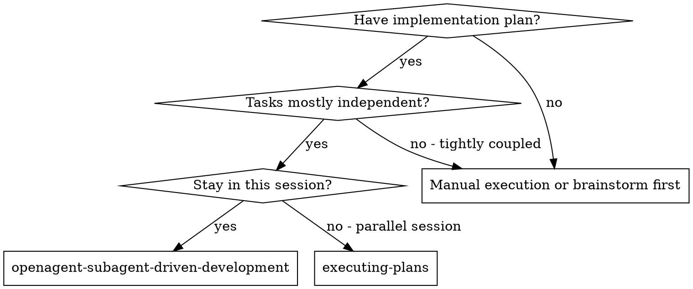

# Subagent-Driven Development - OpenAgent Version

Execute plan by dispatching fresh subagent per task, with two-stage review after each: spec compliance review first, then code quality review. **With approval gates at each major step.**

**Core principle:** Fresh subagent per task + two-stage review (spec then quality) + approval gates = high quality, safe iteration

**OpenAgent integration:** This skill integrates approval gates from OpenAgent's safety-first philosophy. You will request approval before dispatching subagents and proceeding between tasks.

## When to Use



**vs. Executing Plans (parallel session):**
- Same session (no context switch)
- Fresh subagent per task (no context pollution)
- Two-stage review after each task: spec compliance first, then code quality
- Faster iteration (no human-in-loop between tasks)
- **Approval gates for safety**

## The Process with Approval Gates

```dot
digraph process_openagent {
    rankdir=TB;

    subgraph cluster_startup {
        label="Startup";
        approval_read [label="⏸️ REQUEST\nAPPROVAL\nto read plan", shape=diamond, style=filled, fillcolor="#ffffcc"];
        "Read plan, extract all tasks with full text, note context, create TodoWrite" [shape=box];
    }

    subgraph cluster_per_task {
        label="Per Task";
        approval_dispatch [label="⏸️ REQUEST\nAPPROVAL\nto dispatch\nimplementer", shape=diamond, style=filled, fillcolor="#ffffcc"];
        "Dispatch implementer subagent (./implementer-prompt.md)" [shape=box];
        "Implementer subagent asks questions?" [shape=diamond];
        "Answer questions, provide context" [shape=box];
        "Implementer subagent implements, tests, commits, self-reviews" [shape=box];
        approval_spec_review [label="⏸️ REQUEST\nAPPROVAL\nto dispatch\nspec reviewer", shape=diamond, style=filled, fillcolor="#ffffcc"];
        "Dispatch spec reviewer subagent (./spec-reviewer-prompt.md)" [shape=box];
        "Spec reviewer subagent confirms code matches spec?" [shape=diamond];
        "Implementer subagent fixes spec gaps" [shape=box];
        approval_code_review [label="⏸️ REQUEST\nAPPROVAL\nto dispatch\ncode quality\nreviewer", shape=diamond, style=filled, fillcolor="#ffffcc"];
        "Dispatch code quality reviewer subagent (./code-quality-reviewer-prompt.md)" [shape=box];
        "Code quality reviewer subagent approves?" [shape=diamond];
        "Implementer subagent fixes quality issues" [shape=box];
        approval_next [label="⏸️ REQUEST\nAPPROVAL\nto move to\nnext task", shape=diamond, style=filled, fillcolor="#ffffcc"];
        "Mark task complete in TodoWrite" [shape=box];
    }

    subgraph cluster_completion {
        label="Completion";
        "More tasks remain?" [shape=diamond];
        approval_final_review [label="⏸️ REQUEST\nAPPROVAL\nfor final\ncode review", shape=diamond, style=filled, fillcolor="#ffffcc"];
        "Dispatch final code reviewer subagent for entire implementation" [shape=box];
        approval_finish [label="⏸️ REQUEST\nAPPROVAL\nto finish\nbranch", shape=diamond, style=filled, fillcolor="#ffffcc"];
        "Use custom/openagent-finishing-a-development-branch" [shape=box style=filled fillcolor=lightgreen];
    }

    approval_read -> "Read plan, extract all tasks with full text, note context, create TodoWrite" [label="approved"];
    "Read plan, extract all tasks with full text, note context, create TodoWrite" -> approval_dispatch;
    approval_dispatch -> "Dispatch implementer subagent (./implementer-prompt.md)" [label="approved"];
    "Dispatch implementer subagent (./implementer-prompt.md)" -> "Implementer subagent asks questions?";
    "Implementer subagent asks questions?" -> "Answer questions, provide context" [label="yes"];
    "Answer questions, provide context" -> "Dispatch implementer subagent (./implementer-prompt.md)";
    "Implementer subagent asks questions?" -> "Implementer subagent implements, tests, commits, self-reviews" [label="no"];
    "Implementer subagent implements, tests, commits, self-reviews" -> approval_spec_review;
    approval_spec_review -> "Dispatch spec reviewer subagent (./spec-reviewer-prompt.md)" [label="approved"];
    "Dispatch spec reviewer subagent (./spec-reviewer-prompt.md)" -> "Spec reviewer subagent confirms code matches spec?";
    "Spec reviewer subagent confirms code matches spec?" -> "Implementer subagent fixes spec gaps" [label="no"];
    "Implementer subagent fixes spec gaps" -> "Dispatch spec reviewer subagent (./spec-reviewer-prompt.md)" [label="re-review"];
    "Spec reviewer subagent confirms code matches spec?" -> approval_code_review [label="yes"];
    approval_code_review -> "Dispatch code quality reviewer subagent (./code-quality-reviewer-prompt.md)" [label="approved"];
    "Dispatch code quality reviewer subagent (./code-quality-reviewer-prompt.md)" -> "Code quality reviewer subagent approves?";
    "Code quality reviewer subagent approves?" -> "Implementer subagent fixes quality issues" [label="no"];
    "Implementer subagent fixes quality issues" -> "Dispatch code quality reviewer subagent (./code-quality-reviewer-prompt.md)" [label="re-review"];
    "Code quality reviewer subagent approves?" -> approval_next [label="yes"];
    approval_next -> "Mark task complete in TodoWrite" [label="approved"];
    "Mark task complete in TodoWrite" -> "More tasks remain?";
    "More tasks remain?" -> approval_dispatch [label="yes"];
    "More tasks remain?" -> approval_final_review [label="no"];
    approval_final_review -> "Dispatch final code reviewer subagent for entire implementation" [label="approved"];
    "Dispatch final code reviewer subagent for entire implementation" -> approval_finish;
    approval_finish -> "Use custom/openagent-finishing-a-development-branch" [label="approved"];
}
```



## Prompt Templates

- `./implementer-prompt.md` - Dispatch implementer subagent
- `./spec-reviewer-prompt.md` - Dispatch spec compliance reviewer subagent
- `./code-quality-reviewer-prompt.md` - Dispatch code quality reviewer subagent

## Example Workflow with Approval Gates

```
You: I'm using OpenAgent Subagent-Driven Development to execute this plan.

⏸️ REQUEST APPROVAL: "May I read the plan and create TodoWrite tasks?"

[After approval]
[Read plan file once: docs/plans/feature-plan.md]
[Extract all 5 tasks with full text and context]
[Create TodoWrite with all tasks]

Task 1: Hook installation script

⏸️ REQUEST APPROVAL: "May I dispatch implementer subagent for Task 1: Hook installation script?"

[After approval]
[Get Task 1 text and context (already extracted)]
[Dispatch implementation subagent with full task text + context]

Implementer: "Before I begin - should the hook be installed at user or system level?"

You: "User level (~/.config/openagent/hooks/)"

Implementer: "Got it. Implementing now..."
[Later] Implementer:
  - Implemented install-hook command
  - Added tests, 5/5 passing
  - Self-review: Found I missed --force flag, added it
  - Committed

⏸️ REQUEST APPROVAL: "May I dispatch spec compliance reviewer for Task 1?"

[After approval]
[Dispatch spec compliance reviewer]
Spec reviewer: ✅ Spec compliant - all requirements met, nothing extra

⏸️ REQUEST APPROVAL: "May I dispatch code quality reviewer for Task 1?"

[After approval]
[Get git SHAs, dispatch code quality reviewer]
Code reviewer: Strengths: Good test coverage, clean. Issues: None. Approved.

⏸️ REQUEST APPROVAL: "May I move to Task 2? (Task 1 complete)"

[After approval]
[Mark Task 1 complete]

Task 2: Recovery modes

⏸️ REQUEST APPROVAL: "May I dispatch implementer subagent for Task 2: Recovery modes?"

[After approval]
[Get Task 2 text and context (already extracted)]
[Dispatch implementation subagent with full task text + context]

Implementer: [No questions, proceeds]
Implementer:
  - Added verify/repair modes
  - 8/8 tests passing
  - Self-review: All good
  - Committed

⏸️ REQUEST APPROVAL: "May I dispatch spec compliance reviewer for Task 2?"

[After approval]
[Dispatch spec compliance reviewer]
Spec reviewer: ❌ Issues:
  - Missing: Progress reporting (spec says "report every 100 items")
  - Extra: Added --json flag (not requested)

[Implementer fixes issues]
Implementer: Removed --json flag, added progress reporting

[Spec reviewer reviews again]
Spec reviewer: ✅ Spec compliant now

⏸️ REQUEST APPROVAL: "May I dispatch code quality reviewer for Task 2?"

[After approval]
[Dispatch code quality reviewer]
Code reviewer: Strengths: Solid. Issues (Important): Magic number (100)

[Implementer fixes]
Implementer: Extracted PROGRESS_INTERVAL constant

[Code reviewer reviews again]
Code reviewer: ✅ Approved

⏸️ REQUEST APPROVAL: "May I move to Task 3? (Task 2 complete)"

[After approval]
[Mark Task 2 complete]

...

[After all tasks]
⏸️ REQUEST APPROVAL: "May I dispatch final code reviewer for entire implementation?"

[After approval]
[Dispatch final code-reviewer]
Final reviewer: All requirements met, ready to merge

⏸️ REQUEST APPROVAL: "May I use finishing-a-development-branch to complete this work?"

[After approval]
Done!
```

## Advantages

**vs. Manual execution:**
- Subagents follow TDD naturally
- Fresh context per task (no confusion)
- Parallel-safe (subagents don't interfere)
- Subagent can ask questions (before AND during work)
- **Approval gates prevent runaway automation**

**vs. Executing Plans:**
- Same session (no handoff)
- Continuous progress (no waiting)
- Review checkpoints automatic
- **User awareness at every major step**

**Efficiency gains:**
- No file reading overhead (controller provides full text)
- Controller curates exactly what context is needed
- Subagent gets complete information upfront
- Questions surfaced before work begins (not after)

**Quality gates:**
- Self-review catches issues before handoff
- Two-stage review: spec compliance, then code quality
- Review loops ensure fixes actually work
- Spec compliance prevents over/under-building
- Code quality ensures implementation is well-built
- **Approval gates ensure user control**

**Cost:**
- More subagent invocations (implementer + 2 reviewers per task)
- Controller does more prep work (extracting all tasks upfront)
- Review loops add iterations
- Approval gates add human interaction
- But catches issues early (cheaper than debugging later)
- User maintains control throughout process

## Red Flags

**Never:**
- Start implementation on main/master branch without explicit user consent
- Skip reviews (spec compliance OR code quality)
- Proceed with unfixed issues
- Dispatch multiple implementation subagents in parallel (conflicts)
- Make subagent read plan file (provide full text instead)
- Skip scene-setting context (subagent needs to understand where task fits)
- Ignore subagent questions (answer before letting them proceed)
- Accept "close enough" on spec compliance (spec reviewer found issues = not done)
- Skip review loops (reviewer found issues = implementer fixes = review again)
- Let implementer self-review replace actual review (both are needed)
- **Start code quality review before spec compliance is ✅** (wrong order)
- Move to next task while either review has open issues
- **Skip approval gates to "save time"** (defeats OpenAgent safety)
- **Auto-approve on behalf of user** (always wait for explicit approval)

**If subagent asks questions:**
- Answer clearly and completely
- Provide additional context if needed
- Don't rush them into implementation

**If reviewer finds issues:**
- Implementer (same subagent) fixes them
- Reviewer reviews again
- Repeat until approved
- Don't skip the re-review

**If subagent fails task:**
- Dispatch fix subagent with specific instructions
- Don't try to fix manually (context pollution)

## OpenAgent Approval Gate Summary

**Approval points in workflow:**
1. ⏸️ Before reading plan and creating TodoWrite
2. ⏸️ Before dispatching each implementer subagent
3. ⏸️ Before dispatching spec reviewer subagent (per task)
4. ⏸️ Before dispatching code quality reviewer (per task)
5. ⏸️ Before moving to next task
6. ⏸️ Before final code review
7. ⏸️ Before using finishing-a-development-branch

**Why approval gates matter:**
- User maintains control over automation
- Prevents runaway subagent dispatching
- Creates natural checkpoints for oversight
- Aligns with OpenAgent's safety-first philosophy
- User can pause/redirect at any point
- Transparency into what's happening when

## Integration

**Required workflow skills:**
- **custom/openagent-using-git-worktrees** - REQUIRED: Set up isolated workspace before starting
- **custom/openagent-writing-plans** - Creates the plan this skill executes
- **custom/openagent-requesting-code-review** - Code review template for reviewer subagents
- **custom/openagent-finishing-a-development-branch** - Complete development after all tasks

**Subagents should use:**
- **custom/openagent-test-driven-development** - Subagents follow TDD with approval gates for each task

**Alternative workflow:**
- **custom/openagent-executing-plans** - Use for parallel session instead of same-session execution

## Common Rationalizations

| Excuse | Reality |
|--------|---------|
| "Approval gates slow me down" | Gates prevent expensive mistakes. Faster than debugging. |
| "User already approved the plan" | Plan approval ≠ execution approval. User needs visibility. |
| "Subagents are safe, don't need gates" | Automation without oversight = risk. Gates provide control. |
| "I'll just do all tasks then ask" | User wants to see progress. Gates enable intervention. |
| "Asking every time is annoying" | Transparency > convenience. User appreciates control. |
| "Gates are unnecessary ceremony" | Gates = checkpoints. User can redirect if needed. |

**All of these mean: Request approval. No exceptions.**

## Red Flags - STOP and Request Approval

- Dispatching subagent without approval
- Moving to next task without approval
- "User won't mind if I just..."
- "I'll batch approvals to save time"
- "This is too small to need approval"
- "Already got plan approval, that's enough"
- Assuming silence = approval
- **Rationalizing that gates are optional**

**All of these mean: Stop. Request approval first.**

## Final Rule

```
Subagent dispatched → user approved first
Task transition → user approved first
Otherwise → not OpenAgent workflow
```

No exceptions without your human partner's explicit permission.
