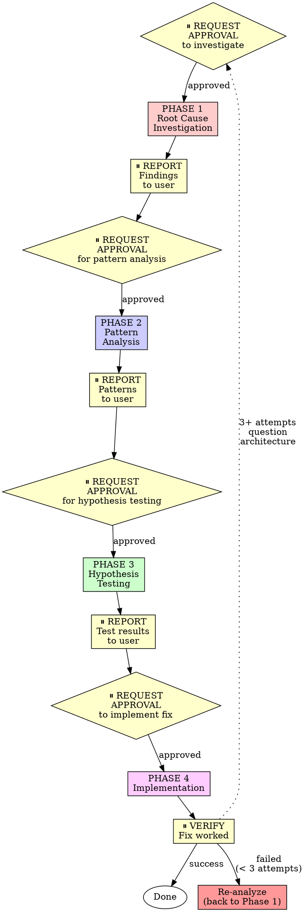

# Systematic Debugging - OpenAgent Version

## Overview

Random fixes waste time and create new bugs. Quick patches mask underlying issues.

**Core principle:** ALWAYS find root cause before attempting fixes. Symptom fixes are failure.

**Violating the letter of this process is violating the spirit of debugging.**

**OpenAgent integration:** This skill integrates approval gates from OpenAgent's safety-first philosophy. You will request approval before each major phase and report findings at each checkpoint.

## The Iron Law

```
NO FIXES WITHOUT ROOT CAUSE INVESTIGATION FIRST
```

If you haven't completed Phase 1, you cannot propose fixes.

## When to Use

Use for ANY technical issue:
- Test failures
- Bugs in production
- Unexpected behavior
- Performance problems
- Build failures
- Integration issues

**Use this ESPECIALLY when:**
- Under time pressure (emergencies make guessing tempting)
- "Just one quick fix" seems obvious
- You've already tried multiple fixes
- Previous fix didn't work
- You don't fully understand the issue

**Don't skip when:**
- Issue seems simple (simple bugs have root causes too)
- You're in a hurry (rushing guarantees rework)
- Manager wants it fixed NOW (systematic is faster than thrashing)

## The Four Phases with Approval Gates



You MUST complete each phase before proceeding to the next.

### Phase 1: Root Cause Investigation

**⏸️ REQUEST APPROVAL:** "May I investigate the root cause of [describe issue]?"

**BEFORE attempting ANY fix, after approval:**

1. **Read Error Messages Carefully**
   - Don't skip past errors or warnings
   - They often contain the exact solution
   - Read stack traces completely
   - Note line numbers, file paths, error codes

2. **Reproduce Consistently**
   - Can you trigger it reliably?
   - What are the exact steps?
   - Does it happen every time?
   - If not reproducible → gather more data, don't guess

3. **Check Recent Changes**
   - What changed that could cause this?
   - Git diff, recent commits
   - New dependencies, config changes
   - Environmental differences

4. **Gather Evidence in Multi-Component Systems**

   **WHEN system has multiple components (CI → build → signing, API → service → database):**

   **BEFORE proposing fixes, add diagnostic instrumentation:**
   ```
   For EACH component boundary:
     - Log what data enters component
     - Log what data exits component
     - Verify environment/config propagation
     - Check state at each layer

   Run once to gather evidence showing WHERE it breaks
   THEN analyze evidence to identify failing component
   THEN investigate that specific component
   ```

   **Example (multi-layer system):**
   ```bash
   # Layer 1: Workflow
   echo "=== Secrets available in workflow: ==="
   echo "IDENTITY: ${IDENTITY:+SET}${IDENTITY:-UNSET}"

   # Layer 2: Build script
   echo "=== Env vars in build script: ==="
   env | grep IDENTITY || echo "IDENTITY not in environment"

   # Layer 3: Signing script
   echo "=== Keychain state: ==="
   security list-keychains
   security find-identity -v

   # Layer 4: Actual signing
   codesign --sign "$IDENTITY" --verbose=4 "$APP"
   ```

   **This reveals:** Which layer fails (secrets → workflow ✓, workflow → build ✗)

5. **Trace Data Flow**

   **WHEN error is deep in call stack:**

   **Backward tracing technique:**

   **Quick version:**
   - Where does bad value originate?
   - What called this with bad value?
   - Keep tracing up until you find the source
   - Fix at source, not at symptom

**⏸️ REPORT TO USER:** "Root cause investigation complete. Findings:
- Error: [exact error message]
- Reproduction steps: [steps]
- Recent changes: [what changed]
- Evidence gathered: [diagnostic results]
- Root cause identified: [what you found]

Ready to proceed to pattern analysis?"

### Phase 2: Pattern Analysis

**⏸️ REQUEST APPROVAL:** "May I analyze patterns to understand the correct implementation?"

**After approval, find the pattern before fixing:**

1. **Find Working Examples**
   - Locate similar working code in same codebase
   - What works that's similar to what's broken?

2. **Compare Against References**
   - If implementing pattern, read reference implementation COMPLETELY
   - Don't skim - read every line
   - Understand the pattern fully before applying

3. **Identify Differences**
   - What's different between working and broken?
   - List every difference, however small
   - Don't assume "that can't matter"

4. **Understand Dependencies**
   - What other components does this need?
   - What settings, config, environment?
   - What assumptions does it make?

**⏸️ REPORT TO USER:** "Pattern analysis complete:
- Working examples found: [list]
- Key differences identified: [list differences]
- Dependencies required: [list]
- Pattern understanding: [summary]

Ready to form hypothesis?"

### Phase 3: Hypothesis and Testing

**⏸️ REQUEST APPROVAL:** "May I test the hypothesis: [state hypothesis clearly]?"

**After approval, use scientific method:**

1. **Form Single Hypothesis**
   - State clearly: "I think X is the root cause because Y"
   - Write it down
   - Be specific, not vague

2. **Test Minimally**
   - Make the SMALLEST possible change to test hypothesis
   - One variable at a time
   - Don't fix multiple things at once

3. **Verify Before Continuing**
   - Did it work? Yes → Phase 4
   - Didn't work? Form NEW hypothesis
   - DON'T add more fixes on top

4. **When You Don't Know**
   - Say "I don't understand X"
   - Don't pretend to know
   - Ask for help
   - Research more

**⏸️ REPORT TO USER:** "Hypothesis test results:
- Hypothesis: [what you tested]
- Test approach: [minimal change made]
- Result: [worked/didn't work]
- Next step: [implement fix OR new hypothesis]

Ready to implement fix?" (if hypothesis confirmed)

### Phase 4: Implementation

**⏸️ REQUEST APPROVAL:** "May I implement the fix for [root cause]?"

**After approval, fix the root cause, not the symptom:**

1. **Create Failing Test Case**
   - Simplest possible reproduction
   - Automated test if possible
   - One-off test script if no framework
   - MUST have before fixing
   - Use the `custom/openagent-test-driven-development` skill for writing proper failing tests

2. **Implement Single Fix**
   - Address the root cause identified
   - ONE change at a time
   - No "while I'm here" improvements
   - No bundled refactoring

3. **Verify Fix**
   - Test passes now?
   - No other tests broken?
   - Issue actually resolved?

4. **If Fix Doesn't Work**
   - STOP
   - Count: How many fixes have you tried?
   - If < 3: Return to Phase 1, re-analyze with new information
   - **If ≥ 3: STOP and question the architecture (step 5 below)**
   - DON'T attempt Fix #4 without architectural discussion

5. **If 3+ Fixes Failed: Question Architecture**

   **Pattern indicating architectural problem:**
   - Each fix reveals new shared state/coupling/problem in different place
   - Fixes require "massive refactoring" to implement
   - Each fix creates new symptoms elsewhere

   **STOP and question fundamentals:**
   - Is this pattern fundamentally sound?
   - Are we "sticking with it through sheer inertia"?
   - Should we refactor architecture vs. continue fixing symptoms?

   **Discuss with your human partner before attempting more fixes**

   This is NOT a failed hypothesis - this is a wrong architecture.

**⏸️ REPORT TO USER:** "Fix implementation complete:
- Test created: [describe test]
- Fix applied: [describe change]
- Verification: [test results]
- Other tests: [status]
- Issue status: [resolved/needs re-analysis]

Ready to commit?" (if fix successful)

## Red Flags - STOP and Follow Process

If you catch yourself thinking:
- "Quick fix for now, investigate later"
- "Just try changing X and see if it works"
- "Add multiple changes, run tests"
- "Skip the test, I'll manually verify"
- "It's probably X, let me fix that"
- "I don't fully understand but this might work"
- "Pattern says X but I'll adapt it differently"
- "Here are the main problems: [lists fixes without investigation]"
- Proposing solutions before tracing data flow
- **"One more fix attempt" (when already tried 2+)**
- **Each fix reveals new problem in different place**
- **Skipping approval gates to "save time"**

**ALL of these mean: STOP. Return to Phase 1.**

**If 3+ fixes failed:** Question the architecture (see Phase 4.5)

## your human partner's Signals You're Doing It Wrong

**Watch for these redirections:**
- "Is that not happening?" - You assumed without verifying
- "Will it show us...?" - You should have added evidence gathering
- "Stop guessing" - You're proposing fixes without understanding
- "Ultrathink this" - Question fundamentals, not just symptoms
- "We're stuck?" (frustrated) - Your approach isn't working

**When you see these:** STOP. Return to Phase 1.

## Common Rationalizations

| Excuse | Reality |
|--------|---------|
| "Issue is simple, don't need process" | Simple issues have root causes too. Process is fast for simple bugs. |
| "Emergency, no time for process" | Systematic debugging is FASTER than guess-and-check thrashing. |
| "Just try this first, then investigate" | First fix sets the pattern. Do it right from the start. |
| "I'll write test after confirming fix works" | Untested fixes don't stick. Test first proves it. |
| "Multiple fixes at once saves time" | Can't isolate what worked. Causes new bugs. |
| "Reference too long, I'll adapt the pattern" | Partial understanding guarantees bugs. Read it completely. |
| "I see the problem, let me fix it" | Seeing symptoms ≠ understanding root cause. |
| "One more fix attempt" (after 2+ failures) | 3+ failures = architectural problem. Question pattern, don't fix again. |
| "Skipping approval saves time" | Approval gates prevent wasted work on wrong approach. |

## Quick Reference

| Phase | Key Activities | Success Criteria | Approval Gates |
|-------|---------------|------------------|----------------|
| **1. Root Cause** | Read errors, reproduce, check changes, gather evidence | Understand WHAT and WHY | ⏸️ Before + Report after |
| **2. Pattern** | Find working examples, compare | Identify differences | ⏸️ Before + Report after |
| **3. Hypothesis** | Form theory, test minimally | Confirmed or new hypothesis | ⏸️ Before + Report after |
| **4. Implementation** | Create test, fix, verify | Bug resolved, tests pass | ⏸️ Before + Verify after |

## When Process Reveals "No Root Cause"

If systematic investigation reveals issue is truly environmental, timing-dependent, or external:

1. You've completed the process
2. Document what you investigated
3. Implement appropriate handling (retry, timeout, error message)
4. Add monitoring/logging for future investigation

**But:** 95% of "no root cause" cases are incomplete investigation.

## Supporting Techniques

These techniques are part of systematic debugging:

- **`root-cause-tracing.md`** - Trace bugs backward through call stack to find original trigger
- **`defense-in-depth.md`** - Add validation at multiple layers after finding root cause
- **`condition-based-waiting.md`** - Replace arbitrary timeouts with condition polling

**Related skills:**
- **custom/openagent-test-driven-development** - For creating failing test case (Phase 4, Step 1)
- **custom/openagent-verification-before-completion** - Verify fix worked before claiming success

## OpenAgent Approval Gate Summary

**Approval points in debugging cycle:**
1. ⏸️ Before Phase 1 (Root Cause Investigation)
2. ⏸️ After Phase 1 (Report findings to user)
3. ⏸️ Before Phase 2 (Pattern Analysis)
4. ⏸️ After Phase 2 (Report patterns to user)
5. ⏸️ Before Phase 3 (Hypothesis Testing)
6. ⏸️ After Phase 3 (Report test results to user)
7. ⏸️ Before Phase 4 (Implementation)
8. ⏸️ After Phase 4 (Verify fix with user)

**Why approval gates matter:**
- Prevents rushing to fixes without understanding
- Ensures user awareness of investigation progress
- Aligns with OpenAgent's safety-first philosophy
- Creates natural checkpoints for course correction
- Stops architectural problems from becoming fix-attempt loops

## Example: Debug Session with Approval Gates

**Issue:** Tests failing with "TypeError: Cannot read property 'id' of undefined"

**⏸️ REQUEST APPROVAL:** "May I investigate the root cause of the TypeError in tests?"

**After approval - PHASE 1 (Root Cause):**
- Error message: Line 42, user.id accessed but user is undefined
- Reproduction: Happens in 3 specific tests, all related to auth
- Recent changes: Updated auth middleware 2 commits ago
- Evidence: Added logging, shows middleware not setting req.user
- Root cause: Middleware conditional broken

**⏸️ REPORT:** "Root cause found: Auth middleware conditional logic broken in commit abc123. The middleware skips setting req.user when token is valid (inverted condition). Ready to analyze pattern?"

**After approval - PHASE 2 (Pattern Analysis):**
- Working examples: Other middleware files in /middleware
- Reference: Express middleware docs
- Difference: Working middleware has if(valid) set user, broken has if(!valid)
- Dependencies: None, pure logic error

**⏸️ REPORT:** "Pattern clear: Logic inversion. Working middleware sets user on valid token, ours skips it. Ready to test hypothesis?"

**After approval - PHASE 3 (Hypothesis Testing):**
- Hypothesis: "Inverting the conditional will fix the issue because the logic is backwards"
- Minimal test: Change if(!isValid) to if(isValid)
- Result: Tests pass locally

**⏸️ REPORT:** "Hypothesis confirmed. Conditional inversion fixes the issue. All tests pass locally. Ready to implement proper fix with test?"

**After approval - PHASE 4 (Implementation):**
- Test created: Added test for valid token setting req.user
- Fix applied: Changed conditional from if(!isValid) to if(isValid)
- Verification: All tests pass, new test prevents regression
- Other tests: All passing

**⏸️ REPORT:** "Fix complete and verified. Test suite passes (87 tests). Ready to commit?"

**After approval - COMMIT:**
```bash
git add tests/auth-middleware.test.ts src/middleware/auth.ts
git commit -m "fix: correct auth middleware conditional logic"
```

## Real-World Impact

From debugging sessions:
- Systematic approach: 15-30 minutes to fix
- Random fixes approach: 2-3 hours of thrashing
- First-time fix rate: 95% vs 40%
- New bugs introduced: Near zero vs common

## Final Rule

```
Bug → Phase 1 investigation → approval gates at each phase → root cause fix
Otherwise → not OpenAgent systematic debugging
```

No exceptions without your human partner's permission.
