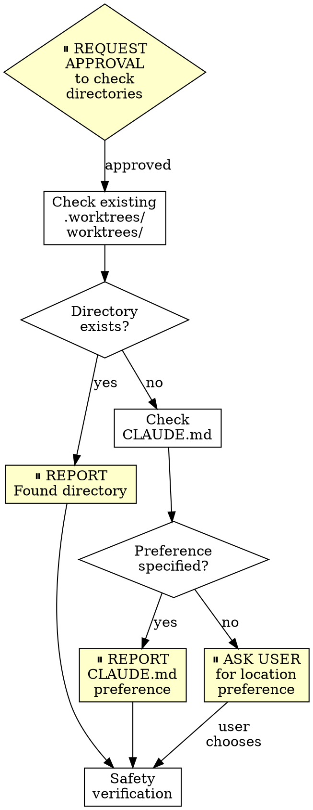

# Using Git Worktrees - OpenAgent Version

## Overview

Git worktrees create isolated workspaces sharing the same repository, allowing work on multiple branches simultaneously without switching. **With approval gates at each phase.**

**Core principle:** Systematic directory selection + safety verification + approval gates = reliable isolation.

**OpenAgent integration:** This skill integrates approval gates from OpenAgent's safety-first philosophy. You will request approval before checking directories, modifying .gitignore, creating worktrees, and running setup.

**Announce at start:** "I'm using the openagent-using-git-worktrees skill to set up an isolated workspace with approval gates."

## Directory Selection Process with Approval Gates



### Step 1: Check Existing Directories

**⏸️ REQUEST APPROVAL:** "May I check for existing worktree directories?"

**After approval, check in priority order:**

```bash
# Check in priority order
ls -d .worktrees 2>/dev/null     # Preferred (hidden)
ls -d worktrees 2>/dev/null      # Alternative
```

**If found:** Report which directory exists. If both exist, `.worktrees` wins.

**⏸️ REPORT:** "Found existing directory: [.worktrees or worktrees]. Using this location."

### Step 2: Check CLAUDE.md

**If no directory exists:**

```bash
grep -i "worktree.*director" CLAUDE.md 2>/dev/null
```

**If preference specified:** Report preference.

**⏸️ REPORT:** "CLAUDE.md specifies worktree directory: [location]. Using this preference."

### Step 3: Ask User

**If no directory exists and no CLAUDE.md preference:**

**⏸️ ASK USER:**
```
No worktree directory found. Where should I create worktrees?

1. .worktrees/ (project-local, hidden)
2. ~/.config/superpowers/worktrees/<project-name>/ (global location)

Which would you prefer?
```

## Safety Verification with Approval Gates

### For Project-Local Directories (.worktrees or worktrees)

**MUST verify directory is ignored before creating worktree:**

```bash
# Check if directory is ignored (respects local, global, and system gitignore)
git check-ignore -q .worktrees 2>/dev/null || git check-ignore -q worktrees 2>/dev/null
```

**If NOT ignored:**

**⏸️ REQUEST APPROVAL:** "Directory [.worktrees or worktrees] is not in .gitignore. May I add it to .gitignore and commit the change?"

**After approval:**
1. Add appropriate line to .gitignore
2. Commit the change
3. Proceed with worktree creation

**⏸️ REPORT:** "Added [directory] to .gitignore and committed. Ready to create worktree."

**Why critical:** Prevents accidentally committing worktree contents to repository.

### For Global Directory (~/.config/superpowers/worktrees)

No .gitignore verification needed - outside project entirely.

**⏸️ REPORT:** "Using global directory - no .gitignore changes needed."

## Creation Steps with Approval Gates

### 1. Detect Project Name

```bash
project=$(basename "$(git rev-parse --show-toplevel)")
```

### 2. Create Worktree

**⏸️ REQUEST APPROVAL:** "May I create worktree at [full-path] for branch [branch-name]?"

**After approval:**

```bash
# Determine full path
case $LOCATION in
  .worktrees|worktrees)
    path="$LOCATION/$BRANCH_NAME"
    ;;
  ~/.config/superpowers/worktrees/*)
    path="~/.config/superpowers/worktrees/$project/$BRANCH_NAME"
    ;;
esac

# Create worktree with new branch
git worktree add "$path" -b "$BRANCH_NAME"
cd "$path"
```

**⏸️ REPORT:** "Worktree created at [full-path]. Ready for project setup."

### 3. Run Project Setup

**⏸️ REQUEST APPROVAL:** "May I run project setup? Detected: [list detected files like package.json, Cargo.toml, etc.]"

**After approval, auto-detect and run appropriate setup:**

```bash
# Node.js
if [ -f package.json ]; then npm install; fi

# Rust
if [ -f Cargo.toml ]; then cargo build; fi

# Python
if [ -f requirements.txt ]; then pip install -r requirements.txt; fi
if [ -f pyproject.toml ]; then poetry install; fi

# Go
if [ -f go.mod ]; then go mod download; fi
```

**⏸️ REPORT:** "Project setup complete. Running baseline tests..."

### 4. Verify Clean Baseline

Run tests to ensure worktree starts clean:

```bash
# Examples - use project-appropriate command
npm test
cargo test
pytest
go test ./...
```

**⏸️ REPORT TEST RESULTS:**

**If tests pass:**
```
Worktree ready at [full-path]
Tests passing ([N] tests, 0 failures)
Ready to implement [feature-name]
```

**If tests fail:**
```
Worktree created at [full-path]
Baseline tests failing: [N] failures

Failures:
[show failure output]

Should I proceed with this worktree, or investigate the failures first?
```

**Wait for user decision before proceeding.**

## Quick Reference

| Situation | Action |
|-----------|--------|
| Starting setup | ⏸️ Request approval to check directories |
| `.worktrees/` exists | Report found, use it (verify ignored) |
| `worktrees/` exists | Report found, use it (verify ignored) |
| Both exist | Report found, use `.worktrees/` |
| Neither exists | Check CLAUDE.md → Ask user |
| Directory not ignored | ⏸️ Request approval to add to .gitignore + commit |
| Before creating worktree | ⏸️ Request approval with full path |
| Before project setup | ⏸️ Request approval, report detected files |
| After baseline tests | ⏸️ Report results (pass or fail) |
| Tests fail during baseline | ⏸️ Report failures + ask whether to proceed |
| No package.json/Cargo.toml | Skip dependency install, report this |

## Common Mistakes

### Skipping approval gates

- **Problem:** User unaware of directory changes, worktree creation, .gitignore modifications
- **Fix:** Always request approval before each major phase

### Skipping ignore verification

- **Problem:** Worktree contents get tracked, pollute git status
- **Fix:** Always use `git check-ignore` before creating project-local worktree

### Assuming directory location

- **Problem:** Creates inconsistency, violates project conventions
- **Fix:** Follow priority: existing > CLAUDE.md > ask

### Proceeding with failing tests without asking

- **Problem:** Can't distinguish new bugs from pre-existing issues
- **Fix:** Report failures, get explicit permission to proceed

### Hardcoding setup commands

- **Problem:** Breaks on projects using different tools
- **Fix:** Auto-detect from project files (package.json, etc.)

### Not reporting what was detected

- **Problem:** User doesn't know what setup will run
- **Fix:** Report detected files before running setup

## Example Workflow with Approval Gates

```
You: I'm using the openagent-using-git-worktrees skill to set up an isolated workspace with approval gates.

⏸️ REQUEST APPROVAL: May I check for existing worktree directories?

[User approves]

[Check .worktrees/ - exists]
⏸️ REPORT: Found existing directory: .worktrees/. Using this location.

[Verify ignored - git check-ignore confirms .worktrees/ is ignored]
⏸️ REPORT: Directory is already in .gitignore. No changes needed.

⏸️ REQUEST APPROVAL: May I create worktree at /Users/jesse/myproject/.worktrees/auth for branch feature/auth?

[User approves]

[Create worktree: git worktree add .worktrees/auth -b feature/auth]
⏸️ REPORT: Worktree created at /Users/jesse/myproject/.worktrees/auth. Ready for project setup.

⏸️ REQUEST APPROVAL: May I run project setup? Detected: package.json

[User approves]

[Run npm install]
⏸️ REPORT: Project setup complete. Running baseline tests...

[Run npm test - 47 passing]
⏸️ REPORT:
Worktree ready at /Users/jesse/myproject/.worktrees/auth
Tests passing (47 tests, 0 failures)
Ready to implement auth feature
```

## Example Workflow with .gitignore Fix

```
You: I'm using the openagent-using-git-worktrees skill to set up an isolated workspace with approval gates.

⏸️ REQUEST APPROVAL: May I check for existing worktree directories?

[User approves]

[Check .worktrees/ - exists]
⏸️ REPORT: Found existing directory: .worktrees/. Using this location.

[Verify ignored - NOT in .gitignore]
⏸️ REQUEST APPROVAL: Directory .worktrees/ is not in .gitignore. May I add it to .gitignore and commit the change?

[User approves]

[Add .worktrees/ to .gitignore]
[Commit: "chore: add .worktrees to gitignore"]
⏸️ REPORT: Added .worktrees/ to .gitignore and committed. Ready to create worktree.

⏸️ REQUEST APPROVAL: May I create worktree at /Users/jesse/myproject/.worktrees/auth for branch feature/auth?

[Continue as normal...]
```

## Example Workflow with Failing Baseline Tests

```
You: I'm using the openagent-using-git-worktrees skill to set up an isolated workspace with approval gates.

[... directory setup ...]

⏸️ REQUEST APPROVAL: May I run project setup? Detected: package.json

[User approves]

[Run npm install]
⏸️ REPORT: Project setup complete. Running baseline tests...

[Run npm test - 2 failing]
⏸️ REPORT:
Worktree created at /Users/jesse/myproject/.worktrees/auth
Baseline tests failing: 2 failures

Failures:
  × auth.test.ts > validates email format
    Expected: { valid: false }
    Received: { valid: true }
  
  × auth.test.ts > rejects weak passwords
    Timeout: test did not complete in 5000ms

Should I proceed with this worktree, or investigate the failures first?

[Wait for user decision]
```

## Red Flags

**Never:**
- Create worktree without verifying it's ignored (project-local)
- Skip baseline test verification
- Proceed with failing tests without asking
- Assume directory location when ambiguous
- Skip CLAUDE.md check
- **Skip approval gates to "save time"**
- **Modify .gitignore without requesting approval**
- **Create worktree without reporting full path first**

**Always:**
- Request approval before checking directories
- Follow directory priority: existing > CLAUDE.md > ask
- Verify directory is ignored for project-local
- Request approval before modifying .gitignore
- Request approval before creating worktree
- Report detected files before running setup
- Request approval before running project setup
- Auto-detect and run project setup
- Verify clean test baseline
- Report test results (pass or fail)
- Ask user decision if baseline tests fail

## OpenAgent Approval Gate Summary

**Approval points in worktree setup:**
1. ⏸️ Before checking directories (initial phase)
2. ⏸️ Report which directory found/chosen
3. ⏸️ Before modifying .gitignore (if needed)
4. ⏸️ Before creating worktree (with full path)
5. ⏸️ Before running project setup (report detected files)
6. ⏸️ After baseline tests complete (report results)
7. ⏸️ If tests fail, ask whether to proceed or investigate

**Why approval gates matter:**
- Prevents accidental .gitignore modifications
- Ensures user awareness of worktree location
- Allows user to see what setup will run
- Creates checkpoints for reviewing test failures
- Aligns with OpenAgent's safety-first philosophy
- Prevents proceeding with failing baseline unknowingly

## Integration

**Called by:**
- **openagent-brainstorming** (Phase 4) - REQUIRED when design is approved and implementation follows
- **subagent-driven-development** - REQUIRED before executing any tasks
- **executing-plans** - REQUIRED before executing any tasks
- Any skill needing isolated workspace

**Pairs with:**
- **finishing-a-development-branch** - REQUIRED for cleanup after work complete

## Final Rule

```
Worktree creation → approval at each phase → verified baseline
Otherwise → not OpenAgent worktree workflow
```

No exceptions without your human partner's permission.
