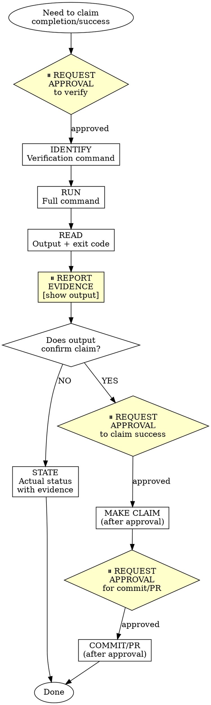

# Verification Before Completion - OpenAgent Version

## Overview

Claiming work is complete without verification is dishonesty, not efficiency.

**Core principle:** Evidence before claims, always. **With approval gates before verification, after verification, and before any completion claims.**

**Violating the letter of this rule is violating the spirit of this rule.**

**OpenAgent integration:** This skill integrates approval gates from OpenAgent's safety-first philosophy. You will request approval before running verification commands, report evidence after verification, and request approval before making any completion claims or git operations.

## The Iron Law

```
NO COMPLETION CLAIMS WITHOUT FRESH VERIFICATION EVIDENCE
```

If you haven't run the verification command in this message, you cannot claim it passes.

## The Gate Function with Approval Gates

```
BEFORE claiming any status or expressing satisfaction:

1. ⏸️ REQUEST APPROVAL: "May I verify [what] by running [command]?"
2. IDENTIFY: What command proves this claim?
3. RUN: Execute the FULL command (fresh, complete)
4. READ: Full output, check exit code, count failures
5. ⏸️ REPORT EVIDENCE: "Verification complete. Evidence: [show full output]. Status: [actual state]"
6. VERIFY: Does output confirm the claim?
   - If NO: State actual status with evidence
   - If YES: Proceed to next gate
7. ⏸️ REQUEST APPROVAL: "May I claim [completion/success] based on this evidence?"
8. ONLY THEN: Make the claim (after approval)

Skip any step = lying, not verifying
Skip any approval gate = violating OpenAgent safety
```

## Approval Gates in Verification Workflow



## Common Failures

| Claim | Requires | Not Sufficient |
|-------|----------|----------------|
| Tests pass | Approval → Test command output: 0 failures → Report evidence → Approval | Previous run, "should pass" |
| Linter clean | Approval → Linter output: 0 errors → Report evidence → Approval | Partial check, extrapolation |
| Build succeeds | Approval → Build command: exit 0 → Report evidence → Approval | Linter passing, logs look good |
| Bug fixed | Approval → Test original symptom: passes → Report evidence → Approval | Code changed, assumed fixed |
| Regression test works | Approval → Red-green cycle verified → Report evidence → Approval | Test passes once |
| Agent completed | Approval → VCS diff shows changes → Report evidence → Approval | Agent reports "success" |
| Requirements met | Approval → Line-by-line checklist → Report evidence → Approval | Tests passing |

## Red Flags - STOP

- Using "should", "probably", "seems to"
- Expressing satisfaction before verification ("Great!", "Perfect!", "Done!", etc.)
- About to commit/push/PR without verification
- Trusting agent success reports
- Relying on partial verification
- Thinking "just this once"
- Tired and wanting work over
- **ANY wording implying success without having run verification**
- **Skipping approval gates to "save time" or "be efficient"**
- **Running verification without requesting approval first**
- **Making completion claims without reporting evidence first**

## Rationalization Prevention

| Excuse | Reality |
|--------|---------|
| "Should work now" | RUN the verification with approval |
| "I'm confident" | Confidence ≠ evidence |
| "Just this once" | No exceptions |
| "Linter passed" | Linter ≠ compiler |
| "Agent said success" | Verify independently with approval |
| "I'm tired" | Exhaustion ≠ excuse |
| "Partial check is enough" | Partial proves nothing |
| "Different words so rule doesn't apply" | Spirit over letter |
| "Approval gates slow me down" | Safety > speed. False claims waste more time. |
| "I already know it works" | Evidence ≠ assumption. Request approval and verify. |
| "User is waiting" | User wants truth, not false claims. |
| "Approval is obvious" | Request explicitly. Never assume. |

## Key Patterns with Approval Gates

**Tests:**
```
⏸️ "May I verify all tests pass by running npm test?"
[After approval]
✅ [Run test command] [See: 34/34 pass]
⏸️ "Verification complete. Evidence: 34/34 tests pass. May I claim all tests pass?"
[After approval]
"All tests pass"

❌ "Should pass now" / "Looks correct"
❌ "Tests pass" (without approval gates)
```

**Regression tests (TDD Red-Green):**
```
⏸️ "May I verify the regression test by running the red-green cycle?"
[After approval]
✅ Write → Run (pass) → Revert fix → Run (MUST FAIL) → Restore → Run (pass)
⏸️ "Verification complete. Evidence: [show all three outputs]. May I claim regression test works?"
[After approval]
"Regression test verified with red-green cycle"

❌ "I've written a regression test" (without red-green verification)
❌ Skipping approval to request red-green verification
```

**Build:**
```
⏸️ "May I verify the build by running npm run build?"
[After approval]
✅ [Run build] [See: exit 0]
⏸️ "Verification complete. Evidence: build exit 0, no errors. May I claim build passes?"
[After approval]
"Build passes"

❌ "Linter passed" (linter doesn't check compilation)
❌ "Build passes" (without approval and evidence)
```

**Requirements:**
```
⏸️ "May I verify all requirements are met by checking against the spec?"
[After approval]
✅ Re-read plan → Create checklist → Verify each → Report gaps or completion
⏸️ "Verification complete. Evidence: [checklist with status for each item]. May I claim phase complete?"
[After approval if all items checked]
"Phase complete - all requirements met"

❌ "Tests pass, phase complete"
❌ Claiming completion without checklist verification
```

**Agent delegation:**
```
⏸️ "May I verify the agent's work by checking the VCS diff?"
[After approval]
✅ Agent reports success → Check VCS diff → Verify changes → Report actual state
⏸️ "Verification complete. Evidence: [diff summary]. Status: [actual state]. May I claim agent completed successfully?"
[After approval if changes match expectations]
"Agent completed successfully"

❌ Trust agent report without verification
❌ Verify diff without approval gates
```

**Before commit/PR:**
```
⏸️ "May I verify all changes are ready by running [test command, linter, build]?"
[After approval]
✅ Run verification → Report evidence
⏸️ "Verification complete. Evidence: [test results, linter output, build status]. All checks pass. May I commit/create PR?"
[After approval]
Proceed with commit/PR

❌ Commit/PR without verification
❌ Commit/PR without approval after verification
```

## Why This Matters

From 24 failure memories:
- your human partner said "I don't believe you" - trust broken
- Undefined functions shipped - would crash
- Missing requirements shipped - incomplete features
- Time wasted on false completion → redirect → rework
- Violates: "Honesty is a core value. If you lie, you'll be replaced."

**OpenAgent addition:** Approval gates prevent rushing to false claims. They create natural checkpoints where you pause, gather evidence, and ensure accuracy before proceeding.

## When To Apply

**ALWAYS before:**
- ANY variation of success/completion claims
- ANY expression of satisfaction
- ANY positive statement about work state
- Committing, PR creation, task completion
- Moving to next task
- Delegating to agents
- **ANY git operations (commit, push, PR)**

**Rule applies to:**
- Exact phrases
- Paraphrases and synonyms
- Implications of success
- ANY communication suggesting completion/correctness

**Approval gates required at:**
1. Before running verification command
2. After verification complete (report evidence)
3. Before making completion claim
4. Before committing or creating PR

## Example: Complete Workflow with Approval Gates

**Scenario:** Bug fix complete, ready to commit

**❌ WITHOUT approval gates (WRONG):**
```
"I've fixed the bug. Tests pass. Committing now."
[Skips verification, makes claim without evidence, commits without approval]
```

**✅ WITH approval gates (CORRECT):**
```
"May I verify the bug fix by running the full test suite?"

[After approval]
[Runs: npm test]
[Reads output: 42/42 tests pass, 0 failures, exit 0]

"Verification complete. Evidence:
- npm test output: 42/42 tests pass
- Exit code: 0
- No failures or errors

The bug fix appears to be working. May I claim the tests pass?"

[After approval]
"All tests pass. May I verify the build by running npm run build?"

[After approval]
[Runs: npm run build]
[Reads output: build successful, exit 0]

"Build verification complete. Evidence:
- npm run build: successful
- Exit code: 0
- No build errors

May I commit these changes?"

[After approval]
git add [files]
git commit -m "fix: [description]"

"Committed successfully."
```

## OpenAgent Approval Gate Summary

**Approval points in verification workflow:**
1. ⏸️ Before running verification command - "May I verify [what] by running [command]?"
2. ⏸️ After verification complete - "Verification complete. Evidence: [full output]. Status: [actual state]"
3. ⏸️ Before making completion claim - "May I claim [success/completion] based on this evidence?"
4. ⏸️ Before committing/PR - "May I commit/create PR with these changes?"

**Why approval gates matter:**
- Prevents rushing to false completion claims
- Ensures user sees evidence before claims are made
- Aligns with OpenAgent's safety-first philosophy
- Creates natural checkpoints for review
- Reinforces "evidence before assertions always"
- Prevents "I'm confident it works" from bypassing verification

## The Bottom Line

**No shortcuts for verification. No skipping approval gates.**

1. Request approval to verify
2. Run the command
3. Read the output
4. Report evidence
5. Request approval to claim
6. THEN claim the result (after approval)

This is non-negotiable.

## Final Rule

```
Completion claim → approval requested → verification run → evidence reported → approval for claim → claim made
Otherwise → not OpenAgent verification
```

No exceptions without your human partner's permission.
