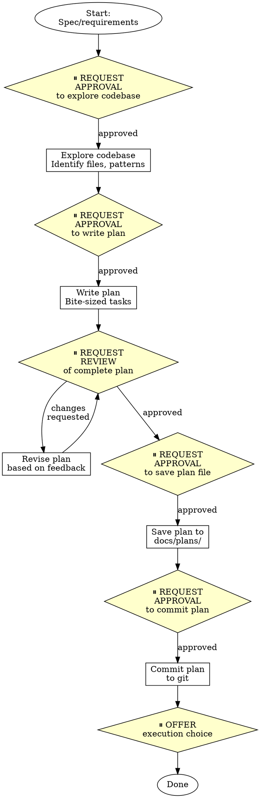

# Writing Plans - OpenAgent Version

## Overview

Write comprehensive implementation plans assuming the engineer has zero context for our codebase and questionable taste. Document everything they need to know: which files to touch for each task, code, testing, docs they might need to check, how to test it. Give them the whole plan as bite-sized tasks. DRY. YAGNI. TDD. Frequent commits.

Assume they are a skilled developer, but know almost nothing about our toolset or problem domain. Assume they don't know good test design very well.

**OpenAgent integration:** This skill integrates approval gates from OpenAgent's safety-first philosophy. You will request approval before each major phase.

**Announce at start:** "I'm using the openagent-writing-plans skill to create the implementation plan."

**Context:** This should be run in a dedicated worktree (created by brainstorming skill).

**Save plans to:** `docs/plans/YYYY-MM-DD-<feature-name>.md`

## Workflow with Approval Gates



### Phase 1: Explore Codebase

**⏸️ REQUEST APPROVAL:** "May I explore the codebase to identify files, patterns, and architecture for this implementation?"

**After approval:**
- Identify relevant files and their purposes
- Find existing patterns to follow
- Locate test files and testing conventions
- Document tech stack and dependencies
- Note any existing similar features

### Phase 2: Write Plan

**⏸️ REQUEST APPROVAL:** "May I write the implementation plan with bite-sized tasks following TDD?"

**After approval, create plan following structure below.**

### Phase 3: Review Plan

**⏸️ REQUEST REVIEW:** "Plan complete. Here's the summary:
- [Number] tasks identified
- Files to create: [list]
- Files to modify: [list]
- Key architectural decisions: [summary]

May I show you the complete plan for review?"

**After showing plan:** Wait for approval or revision feedback.

### Phase 4: Save Plan

**⏸️ REQUEST APPROVAL:** "May I save this plan to `docs/plans/YYYY-MM-DD-<feature-name>.md`?"

**After approval:** Save the plan file.

### Phase 5: Commit Plan

**⏸️ REQUEST APPROVAL:** "May I commit the plan? Files: [list files]"

**After approval:**
```bash
git add docs/plans/YYYY-MM-DD-<feature-name>.md
git commit -m "docs: add implementation plan for <feature-name>"
```

### Phase 6: Offer Execution Choice

**⏸️ OFFER EXECUTION CHOICE:** (See Execution Handoff section below)

## Bite-Sized Task Granularity

**Each step is one action (2-5 minutes):**
- "Write the failing test" - step
- "Run it to make sure it fails" - step
- "Implement the minimal code to make the test pass" - step
- "Run the tests and make sure they pass" - step
- "Commit" - step

## Plan Document Header

**Every plan MUST start with this header:**

```markdown
# [Feature Name] Implementation Plan

> **For Claude:** REQUIRED SUB-SKILL: Use custom/openagent-executing-plans to implement this plan task-by-task.

**Goal:** [One sentence describing what this builds]

**Architecture:** [2-3 sentences about approach]

**Tech Stack:** [Key technologies/libraries]

---
```

## Task Structure

```markdown
### Task N: [Component Name]

**Files:**
- Create: `exact/path/to/file.py`
- Modify: `exact/path/to/existing.py:123-145`
- Test: `tests/exact/path/to/test.py`

**Step 1: Write the failing test**

```python
def test_specific_behavior():
    result = function(input)
    assert result == expected
```

**Step 2: Run test to verify it fails**

Run: `pytest tests/path/test.py::test_name -v`
Expected: FAIL with "function not defined"

**Step 3: Write minimal implementation**

```python
def function(input):
    return expected
```

**Step 4: Run test to verify it passes**

Run: `pytest tests/path/test.py::test_name -v`
Expected: PASS

**Step 5: Commit**

```bash
git add tests/path/test.py src/path/file.py
git commit -m "feat: add specific feature"
```
```

## Remember
- Exact file paths always
- Complete code in plan (not "add validation")
- Exact commands with expected output
- Reference relevant skills with @ syntax
- DRY, YAGNI, TDD, frequent commits

## Execution Handoff

After committing the plan, offer execution choice:

**⏸️ OFFER EXECUTION CHOICE:**

**"Plan complete and saved to `docs/plans/<filename>.md`. Two execution options:**

**1. Subagent-Driven (this session)** - I dispatch fresh subagent per task, review between tasks, fast iteration

**2. Parallel Session (separate)** - Open new session with executing-plans, batch execution with checkpoints

**Which approach?"**

**If Subagent-Driven chosen:**
- **REQUIRED SUB-SKILL:** Use custom/openagent-subagent-driven-development
- Stay in this session
- Fresh subagent per task + code review

**If Parallel Session chosen:**
- Guide them to open new session in worktree
- **REQUIRED SUB-SKILL:** New session uses custom/openagent-executing-plans

## OpenAgent Approval Gate Summary

**Approval points in planning workflow:**
1. ⏸️ Before exploring codebase
2. ⏸️ Before writing plan
3. ⏸️ After plan complete (review before saving)
4. ⏸️ Before saving plan file
5. ⏸️ Before committing plan
6. ⏸️ Before offering execution choice

**Why approval gates matter:**
- Prevents unnecessary codebase exploration
- Ensures user awareness of plan structure
- Creates natural checkpoints for review
- Aligns with OpenAgent's safety-first philosophy
- Allows user to guide planning direction

## Red Flags - Skipping Approval Gates

- Starting codebase exploration without approval
- Writing plan without approval
- Saving plan without review
- Committing without approval
- **"This is just planning, doesn't need approval"**
- **"I'll show it after it's complete"**
- **"Approval gates slow down planning"**
- **"Skipping gates to save time"**

**All of these mean: Stop. Request approval at each phase.**

## Final Rule

```
Planning with approval gates → user awareness at each phase → OpenAgent planning
Otherwise → not OpenAgent planning
```

No exceptions without your human partner's permission.
